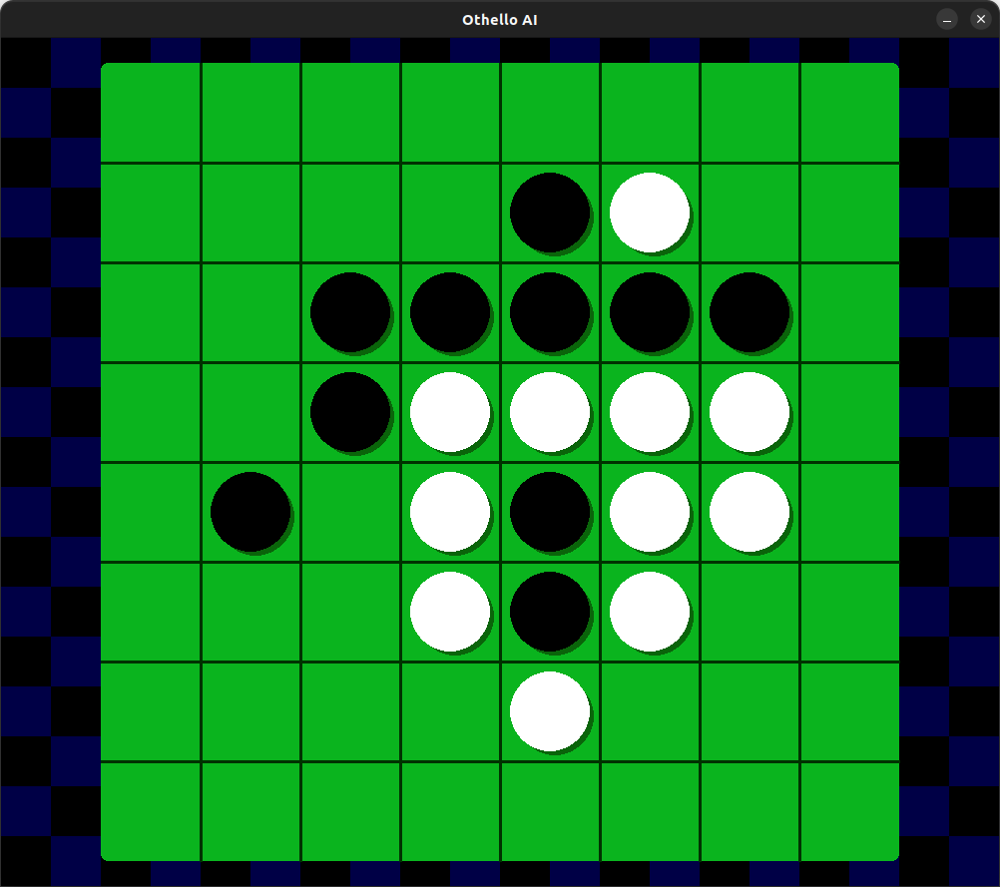

# othello-py

## tech


## description

### about model

- using CNN
- trained using professional data

#### input

```python
data = [
    [(0, 0), (0, 0), (0, 0), (0, 0), (0, 0), (0, 0), (0, 0), (0, 0)],
    [(0, 0), (0, 0), (0, 0), (0, 0), (0, 0), (0, 0), (0, 0), (0, 0)],
    [(0, 0), (0, 0), (0, 0), (0, 0), (0, 0), (0, 0), (0, 0), (0, 0)],
    [(0, 0), (0, 0), (0, 0), (0, 1), (1, 0), (0, 0), (0, 0), (0, 0)],
    [(0, 0), (0, 0), (0, 0), (1, 0), (0, 1), (0, 0), (0, 0), (0, 0)],
    [(0, 0), (0, 0), (0, 0), (0, 0), (0, 0), (0, 0), (0, 0), (0, 0)],
    [(0, 0), (0, 0), (0, 0), (0, 0), (0, 0), (0, 0), (0, 0), (0, 0)],
    [(0, 0), (0, 0), (0, 0), (0, 0), (0, 0), (0, 0), (0, 0), (0, 0)],
] # (1, 0) -> Black,  (0, 1) -> White
```

#### output

```python
data = [0.0, 0.0, ... 0.0, 0.0] # 64 floats
```

### remake version

I ported a machine learning model from tensorflow to pytorch.

The old version has been archived.

https://github.com/Oya-Tomo/othello-py-tf

## demo

<div align=center>
    
</div>

## reference

- https://www.ffothello.org/informatique/la-base-wthor/
